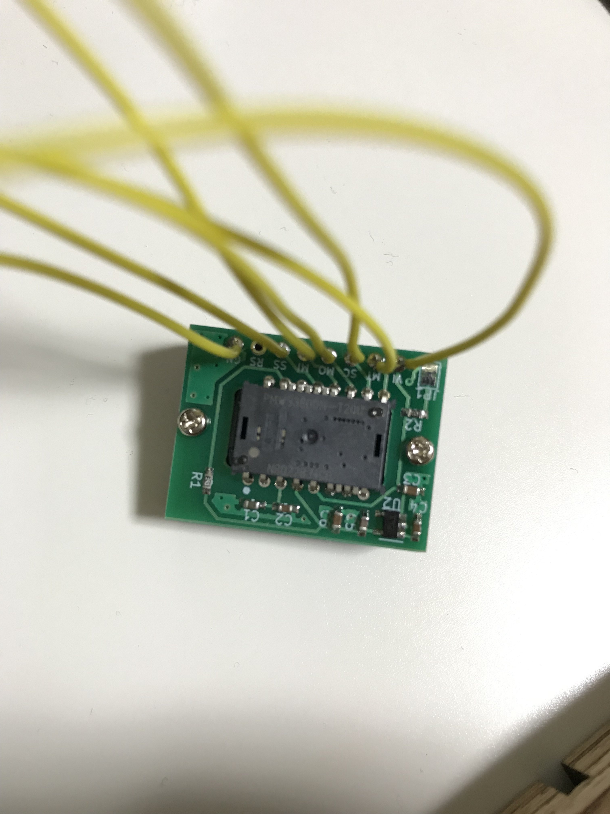

# PMW3360-Module

## 部品

| Name | Qty | Description | Manufacturer
----|----|----|----
| U1 | 1 | PMW3360-T2QU | PixArt Imaging Inc. |
| U2 | 1 | 1.9V VOLTAGE REGULATOR, S-1313D19-M5T1U3 | ABLIC Inc. |
| C1 | 1 | Capacitor, 4.7uF, 1608 |  |
| C2,C4,C5 | 3 | Capacitor, 0.1uF, 1608 |  |
| C3,C6 | 2 | Capacitor, 10uF, 1608 |  |
| R1 | 1 | Resistor, 39 Ohm, 1608 ||
| R2 | 1 | Resistor, 10k Ohm, 1608 ||
## License

https://creativecommons.org/licenses/by/4.0/
